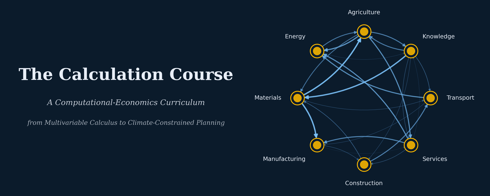

{.cover-banner fig-alt="201 — Zhang's Marxian Formalization"}

## About this course

This course is a sequel to [The Calculation Course](/courses/the_calculation_course/). It is currently a **stub** — the syllabus will be written after completing the seminar between Controversies 5 and 6 in the 101 course, once the author has real views about what the sequel should look like.

See the placeholder in the Calculation Course (`201/placeholder.qmd`) for the full rationale and planned scope.

## Prerequisites

Complete all 10 weeks and all 7 controversies of The Calculation Course, with particular attention to:

- The seminar on the Chinese critique of the Japanese School (between Controversies 5 and 6)
- Controversy 3 (Transformation Problem) and Controversy 5 (Okishio's Theorem)
- The Zhang 2023 paper: "The Formalization of Marx's Economics" (*WRPE* 14(1))

## Planned scope

Roughly 8–10 weeks covering Zhang's Vol I formalization program:

1. Value theory formalization (the mapping f: A → w)
2. Competition as a dynamic game (prisoner's dilemma payoff matrices)
3. Realization uncertainty and crisis probability
4. The labor process as a cybernetic system
5. Unemployment dynamics (Zhang's differential equation)
6. Capital accumulation and the LTFRP (game-theoretic route)
7. Primitive accumulation / deprivation process
8. Unified computational framework

*This page will be expanded into a full syllabus when the time comes.*
