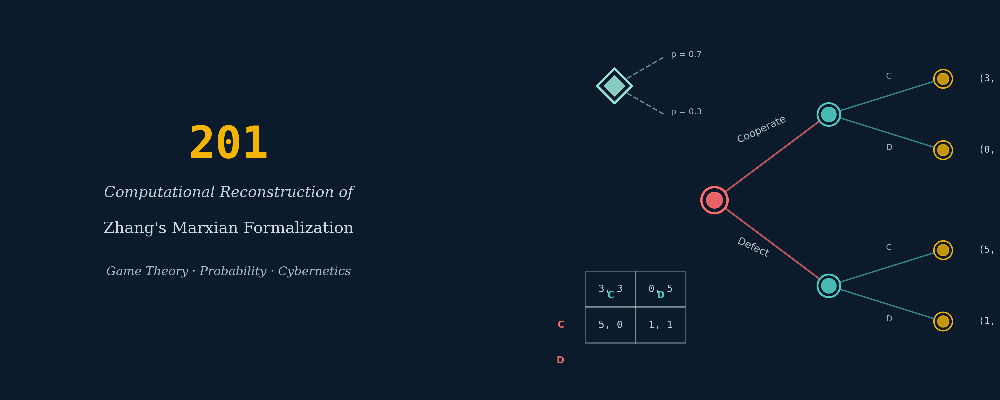

{.cover-banner fig-alt="Zhang's Marxian Formalization — Research Project"}

## About this research project

This is a **research project**, not a course. There is no syllabus, no fixed pacing, no exercises. The goal is a body of work — reading notes, working papers, an open-source library, and (if the work warrants) a methodology paper for *World Review of Political Economy* — that constitutes a computationally rigorous companion to Zhang Xian's 2023 *WRPE* paper "The Formalization of Marx's Economics."

The project should be elaborated *after* the seminar between Controversies 5 and 6 in [The Calculation Course](/courses/the_calculation_course/), because until you have read Zhang 2023 carefully and sat with it, neither you nor anyone else can scope the work properly. The page you are reading was written in 2025 as a holding pattern — sufficient to keep the thread alive, insufficient as an actual research plan. Expand it when you have actual views.

## Why this project exists

Zhang's 2023 paper ("The Formalization of Marx's Economics: A Summary Attempt Taking as an Example the First Volume of Capital," *WRPE* 14(1): 4–33) sketches a mathematical formalization of Marx's Vol I apparatus that is explicitly not Morishima's. Where Morishima and the Japanese School formalize using non-negative matrix theory and input-output analysis, Zhang brings in a wider toolkit: game theory (producer competition as a prisoner's dilemma), probability theory (commodity realization as a random variable with a distribution over successful / partial / failed outcomes), cybernetic control systems (the labor process as a feedback-regulated system), and continuous-time differential equations (unemployment-rate dynamics, capital accumulation). Zhang writes these equations down but does not implement them. To the best of what can be established from a literature search, nobody has. A computationally rigorous companion to Zhang 2023 — a Jupyter notebook or small library that actually runs each of the models he sketches — would be a genuine scholarly contribution and a plausible methodology paper for *WRPE* or a similar venue.

## Prerequisites

Complete all 10 weeks and all 7 controversies of [The Calculation Course](/courses/the_calculation_course/), with particular attention to:

- The seminar on the Chinese critique of the Japanese School (between Controversies 5 and 6).
- Controversy 3 (Transformation Problem) and Controversy 5 (Okishio's Theorem).
- Zhang, "The Formalization of Marx's Economics: A Summary Attempt Taking as an Example the First Volume of Capital" (*WRPE* 14(1), 2023).

## Working areas

Eight areas tracking Zhang's 2023 Vol I formalization. Each is a research thread, not a teaching unit — there is no fixed pacing, no exercises, no "weeks." Each thread produces some combination of working notes, a short paper, a notebook, or library code.

- **Value theory formalization.** The mapping f: A → w, socially-necessary-labor-time in both the Vol I and Vol III senses, the fundamental theorem of the labor theory of value (W inversely proportional to labor productivity), labor complexity via h(t). Artifact: implement Zhang's value system and demonstrate numerically that his distinction between the two senses of SNLT produces different results than Morishima's conflated version. Compare with the Calculation Course Week 7 input-output value calculations.

- **Competition as a dynamic game.** The prisoner's-dilemma payoff matrix for technology adoption, the mixed-strategy and repeated-game extensions Zhang sketches but doesn't fully develop. Artifact: a multi-agent simulation of N producers with heterogeneous technologies, each choosing to adopt or not, tracking the emergence of Zhang's claimed dynamics (technology generalization, excess-return disappearance, value decline). This is where you'd be *extending* Zhang, not just implementing him.

- **Realization uncertainty and crisis probability.** The distribution F(s) = P(S ≤ s) over commodity-realization outcomes, the means-of-payment function, and debt-crisis probability. Artifact: a stochastic simulation of a multi-period commodity economy with realization failures, tracking how crisis propagates through the payment system. Connects directly to the SFC work in Controversy 7, the realization framework in Controversy 6, and the ergodicity sidebar.

- **The labor process as a cybernetic system.** Zhang's equation y = x · S / (1 − SR) from his "labor as cybernetic process" section. The sketchiest part of his program. Artifact: a control-theoretic model of the labor process as Zhang implies it should work, using `scipy.signal` or similar, testing whether it produces the qualitative results Zhang claims (the "expansion capacity of capital," the quality-weighted production function).

- **Unemployment dynamics.** Zhang's differential equation da_u / dt = λ_u (1 − a_u) − λ_e · a_u and its solution for the steady-state unemployment rate. Artifact: simulate under different transition probabilities; compare with BEA / BLS unemployment time series; examine the relative-surplus-population claim empirically.

- **Capital accumulation and the LTRPF.** Zhang's reformulation of the Okishio debate — the prisoner's-dilemma route to a falling rate of profit as a compound result of individual capital pursuing excess returns. Extends most directly from Calculation Course Controversy 5. Artifact: implement Zhang's game-theoretic LTRPF mechanism as an N-agent simulation; compare trajectories with Okishio's simultaneist rate and TSSI's temporal rate on the same underlying economy.

- **The primitive accumulation / deprivation process.** Zhang's stochastic deprivation function N_b = t · R^F · N_a. Almost nobody works on this formally. Artifact: a historical calibration exercise.

- **Putting it together.** A unified computational framework that runs through Zhang's Vol I formalization end-to-end, tied to a single running economy (probably a calibrated toy with 3–5 sectors).

## Outside sources that would pair naturally

- Bin Yu's Engels School work on Okishio and value theory (*WRPE* 13(2), 2022 and beyond — search the WRPE back catalog).
- Zhang's Chinese-language corpus (Zhang 2009, 2011, 2018) — these are in *Teaching and Research* and *Studies on Marxism* and would need translation, machine or otherwise.
- Cogliano, Veneziani, and Yoshihara, "Computational Methods and Classical-Marxian Economics" (*Journal of Economic Surveys* 36(2), 2022) — the QMUL group's survey of computational approaches to classical-Marxian theory.
- Duncan Foley and Ernesto Screpanti work on formal interpretations of Marx.
- The *China Political Economy* journal (Emerald) for adjacent work.

## Prospective endpoints

Three plausible endpoints if the project succeeds. They are not mutually exclusive.

1. **A methodology paper submitted to *WRPE*** presenting the computational companion to Zhang 2023, co-authored with Zhang himself if he is interested (his email is in the papers: zxscu@126.com). The most ambitious endpoint and not the obvious one to start with.
2. **An open-source library** — `marxecon` or similar — implementing the Morishima-Okishio framework, the TSSI framework, and the Zhang framework as alternative backends against the same economy object. This would let any future researcher do side-by-side comparison numerically rather than just rhetorically, which currently they can't. Probably the highest-leverage endpoint given an infrastructure-engineering background.
3. **A direct contribution to the Cockshott / Dapprich planning tradition.** Dapprich's 2023 consumer-feedback planning paper already has code (*Review of Political Economy*). A Zhang-compatible version of Dapprich's apparatus would be interesting work. Dapprich is at Potsdam and reachable.

## Background that would help, when it's time

Most of what is needed comes from the Calculation Course. Additional background that would help:

- A game theory refresher: Osborne and Rubinstein's *A Course in Game Theory* (free PDF) or Fudenberg and Tirole for the more advanced material. A week's reading.
- Basic stochastic processes / Markov chains: the relevant chapters of Grinstead and Snell's *Introduction to Probability* (free CC PDF).
- Control theory at an introductory level: Åström and Murray's *Feedback Systems* (free PDF).
- Agent-based modeling: the *Mesa* Python library has a good tutorial; one afternoon's work to get oriented.

None of these are massive investments individually. The project would thread them in as needed rather than frontloading them.

## When to start

After the seminar between Controversies 5 and 6 in the Calculation Course. By then you will have read all three of Zhang's English *WRPE* papers plus Bin Yu's companion piece, you will know whether the critique lands for you and whether the positive program holds water, and you will have real views about what the project should look like. If at that point you still want to push the work forward, expand this skeleton into actual working artifacts. If by then you've decided Zhang's program is more promising as a future research contribution than as something to elaborate now, the page still served its purpose — it named the thing so you could find it again.

Whatever version of the project actually gets done: the deliverable should be concrete, public, and citable. That is what separates this from another year of reading.
