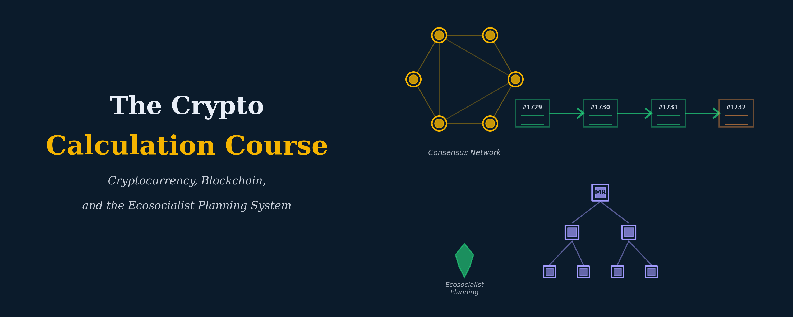

{.cover-banner fig-alt="Postcapitalist Coordination and Planning After AI — Research Track"}

## About this research track

This is a **research track**, not a course. There is no syllabus, no fixed pacing, no exercises. The format is reading and reflection: long-form working notes, position papers as they accrete, occasional simulations where they help clarify a claim, and an evolving annotated bibliography.

The track is organized around a single animating question: **what does post-capitalist coordination look like when generative AI is the dominant general-purpose technology?**

That question crystallized in late 2025 in a four-piece exchange in [*The Ideas Letter*](https://theideasletter.org/) between Evgeny Morozov, Aaron Benanav, and Leif Weatherby, joined a few months later by Paul Mason from a different angle in *Conflict & Democracy*. Those five pieces — see [Source texts](sources.qmd) for the full set with URLs — are the entry point. But the conversation reaches outward into intellectual histories that no one piece tries to cover on its own: the post-1991 turn in neoliberal political economy, the technical-ideological history of optimization-as-computing, the empirical labor economics of agentic AI rollout, the Marxist value-form / Habermas-critical / Castoriadian / Echeverrian / Joasian pragmatist apparatus that lurks under Morozov's "worldmaking" frame, and the parallel question of whether blockchain coordination infrastructure is really an alternative to the worlds Benanav and Morozov fight over or just another expression of them.

## Why this is a research track and not a course

Three reasons.

First, the material is genuinely open. The five primary texts disagree about what's happening, what the political-economic stakes are, and what intellectual lineage applies. None of them is a settled answer one could teach.

Second, the four threads — call them political-economy, technical-history, philosophical, empirical — pull on different toolkits. A course would force a single sequence; a research track lets each thread breathe at its own pace.

Third, the artifacts that should come out of this work are not exercises. They are working papers, an annotated bibliography that doesn't yet exist anywhere, and possibly small simulators (a multi-criterial Investment Board allocator; a Project-Vend-style agent in a controlled setting) when an experiment can clarify what the philosophical apparatus is talking about.

## Relationship to The Calculation Course

This track sits downstream of [The Calculation Course](/courses/the_calculation_course/), and especially of [Controversy 2 (The Socialist Calculation Debate)](/courses/the_calculation_course/controversies/controversy-02-calculation.html). One of Morozov's central polemical claims is that the Calculation Debate as the Marxist tradition still imagines it — Mises / Hayek / Lange / Neurath / Cockshott — was *sublated* by post-1990 neoliberal political economy (Buchanan & Vanberg's "The Market as a Creative Process," 1991), and that the Marxist tradition has been polishing input-output tables while the actual battlefield moved on. Whether that claim holds is the first thread of this track.

Prerequisites are the same as the Calculation Course's, particularly: Controversy 2 (Calculation), Controversy 6 (Monetary Theory of Production), Controversy 7 (Money and Stock-Flow Consistency), Controversy 8 (Climate-Constrained Planning). Familiarity with the Postone / value-form / Habermas / Castoriadis lineage is assumed where it lands but not required to start.

## Threads

The track is organized as six threads. They are not chapters in a sequence; they are independent lines of work that cross-reference each other where the texts demand it.

1. **[The Calculation Debate after 1991](threads/thread-01-calculation-debate-after-1991.qmd)** — Buchanan-Vanberg's "creative process" reframe, the Hayek → entrepreneur shift, why Cockshott-style answers don't engage what neoliberalism actually became.
2. **[Multi-Criterial Planning Under AI](threads/thread-02-multi-criterial-planning.qmd)** — Benanav's Investment Boards / Data Matrix / dual-currency framework on its own terms; Morozov's structural objections; an attempt at an honest reconstruction.
3. **[Optimization, Economics, and Computing as One Phenomenon](threads/thread-03-optimization-economics-computing.qmd)** — Weatherby's thread, traced through von Neumann / Wald / Savage / Dantzig / RAND / Becker / Friedman / ML / RL / LLMs; Recht's *The Irrational Decision* as the touchstone; Anthropic's Project Vend as a symptom.
4. **[The Empirical Political Economy of AI Labor Markets](threads/thread-04-ai-labor-markets.qmd)** — Mason's data-led arc: Acemoglu-Restrepo, Aghion / Baumol's Disease, the Stanford HAI Index, the bullshit-jobs-as-financialization claim, the late-2020s capital scarcity overlay.
5. **[The Philosophical Apparatus](threads/thread-05-philosophical-apparatus.qmd)** — Morozov's realm × action grid; Marx's unresolved oscillation between two-realm and one-realm formulations; Castoriadis on the capitalist imaginary; Echeverría's baroque ethos and his rereading of use-value; Postone and value-form theory; Hans Joas on the creativity of action; the Habermas critique implicit in Benanav's framework.
6. **[Crypto and Blockchain as Coordination Infrastructure](threads/thread-06-crypto-coordination.qmd)** — absorbed from the prior crypto course stub. Reframed under the same animating question: do blockchain mechanisms (DAOs, governance tokens, labor tokens, on-chain coordination) constitute an alternative to the worlds Morozov and Benanav fight over, or another expression of the optimization-economics-computing complex?

## Prospective artifacts

Each thread can produce one or more of:

- A **working paper** (long-form synthesis, citable as a preprint).
- An **annotated bibliography** specific to the thread (becomes part of the [bibliography](bibliography.qmd)).
- A **small simulator or notebook** when a claim is sharper as code than as prose — for example, a multi-criterial Investment Board allocator (Thread 2), a recreation of the Buchanan-Vanberg "no external objective" claim against a planning LP (Thread 1), or a critical replication of Project Vend at small scale (Thread 3).

The track does not commit to any specific publication endpoint in advance. The point is to learn the terrain; if the work warrants a paper, that comes later.

## Source texts

The five primary texts plus their URLs are kept in [Source texts](sources.qmd). Read them at least once before starting any thread.

## Bibliography

The [bibliography](bibliography.qmd) is incremental — it grows as references appear in any thread. It is the index of secondary literature and historical source material that the track relies on.
